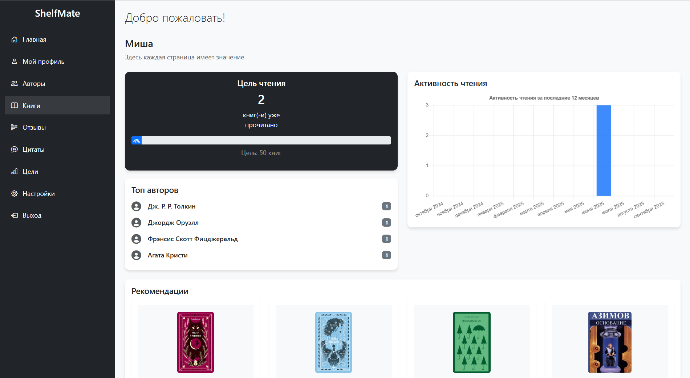
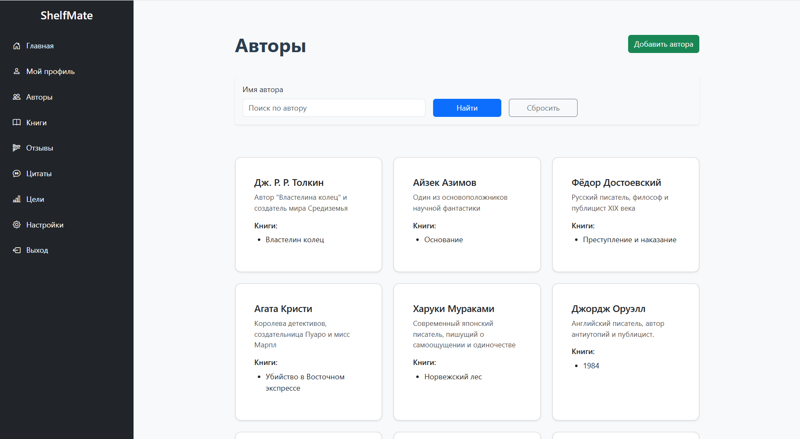
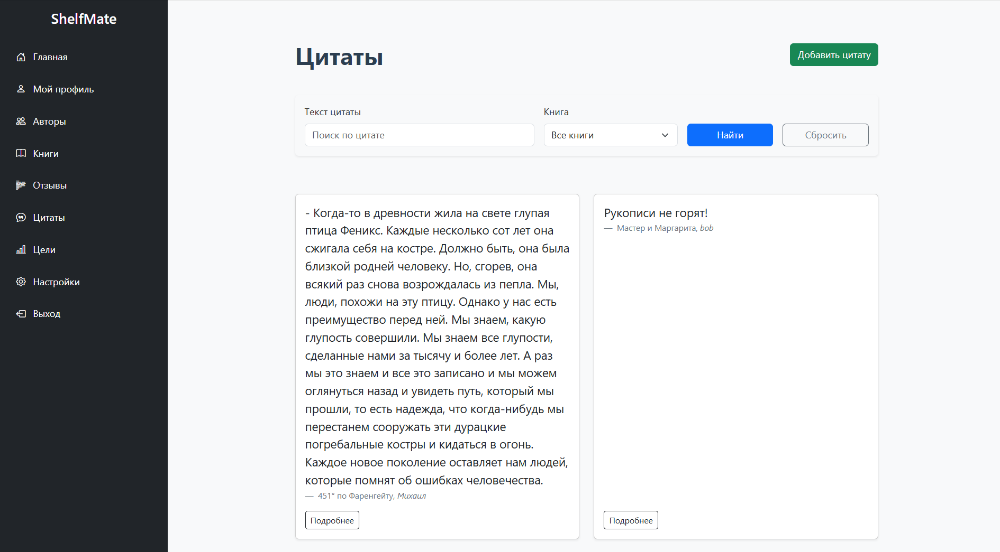
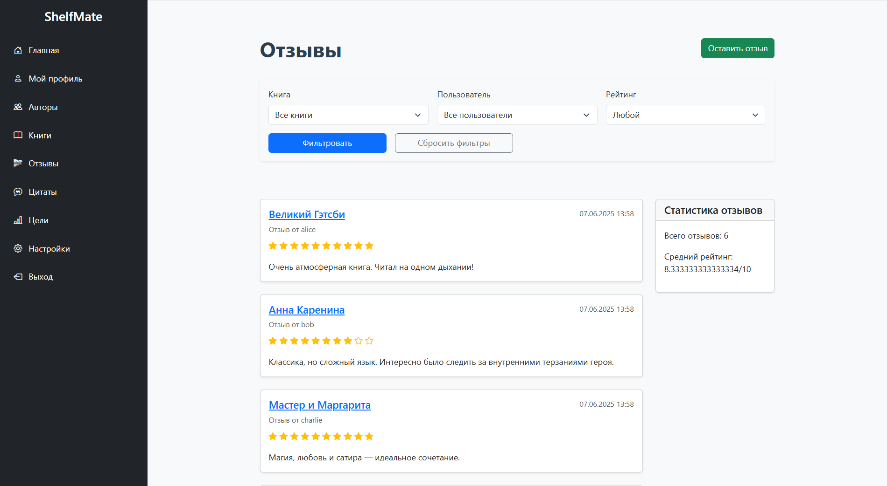
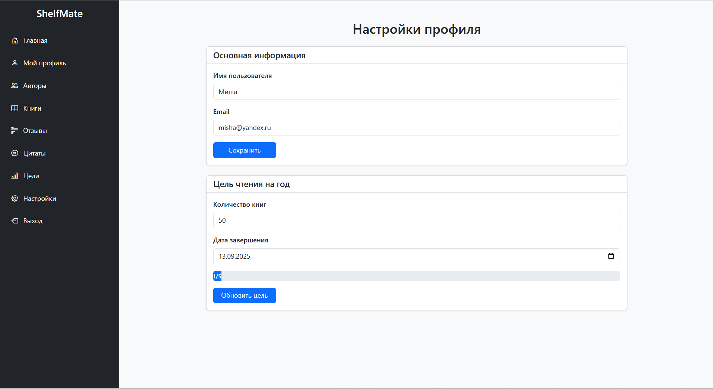
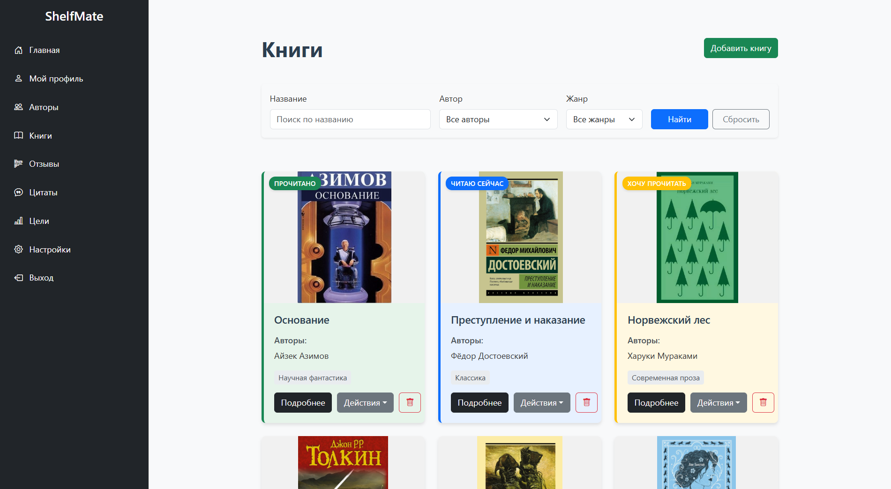
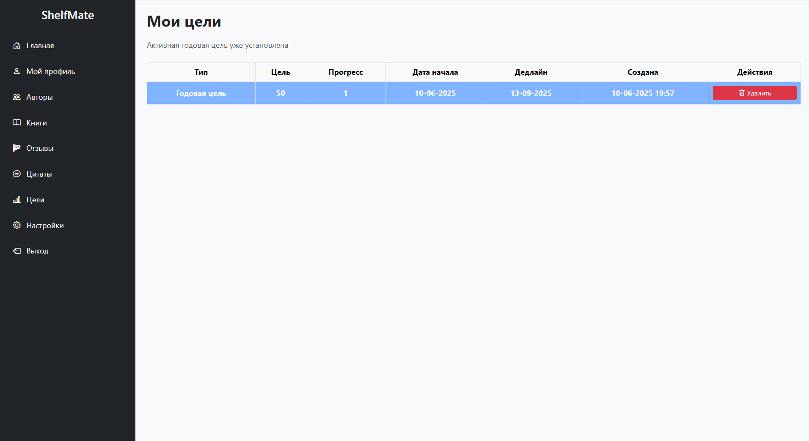

# ShelfMate

**ShelfMate** — это разрабатываемое веб-приложение для индивидуального использования, предназначенное для пользователей, желающих отслеживать свой прогресс в чтении книг, устанавливать цели и анализировать свою читательскую активность. Приложение подходит как для образовательных целей (например, студентам и преподавателям), так и для личной организации чтения.

## Основные возможности

- **Добавление книг в ваш виртуальный книжный шкаф**
- **Отслеживание прогресса чтения (количество прочитанных страниц, статус книги и др.)**
- **Постановка и контроль персональных целей по чтению**
- **Аналитика читательской активности (статистика, графики и отчеты)**
- **Удобный и интуитивный веб-интерфейс**

## Стек технологий

- **Backend:**
  - Java
  - Spring Boot
  - Spring Security
  - Spring Data JPA

- **Frontend:**
  - HTML
  - CSS
  - Bootstrap

- **База данных:**
  - PostgreSQL

## Архитектура

- **Веб-интерфейс пользователя:** доступ через браузер.
- **Серверная часть:** реализована с использованием Spring Boot.
- **Система хранения и обработки данных:** PostgreSQL.
## Пользовательские интерфейсы

В ShelfMate реализованы следующие страницы и элементы навигации:

| Интерфейс         | Описание                                                                                 | Пример скриншота     |
|-------------------|------------------------------------------------------------------------------------------|----------------------|
| **Главная**       | Общее количество прочитанных книг, текущий прогресс по цели, установка новой цели        |         |
| **Мой профиль**   | Книги пользователя по категориям                                                         |      |
| **Авторы**        | Список всех авторов, поиск по имени                                                      |       |
| **Цитаты**        | Просмотр, добавление и фильтрация цитат по книгам, поиск                                 |        |
| **Отзывы**        | Рецензии на книги, добавление и фильтрация по оценке, книге, автору                      |       |
| **Настройки**     | Редактирование профиля, электронной почты, цели                                          |   |
| **Книги**         | Управление списком книг, фильтрация, добавление, редактирование, удаление                |          |
| **Цели**          | Просмотр прошлых и текущих целей, установка новой                                        |           |
| **Регистрация/вход**         | Регистрация/вход пользователей                                                |    |

